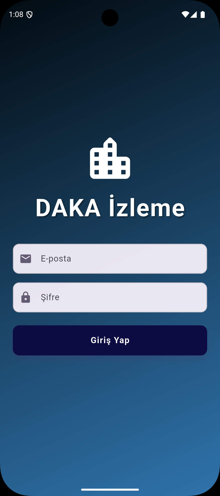
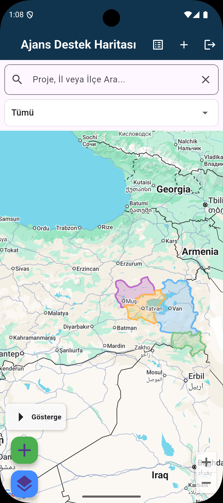
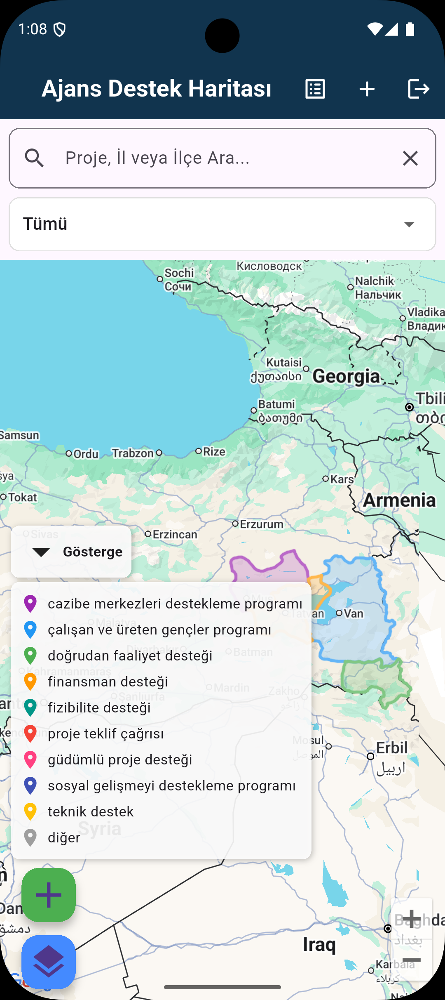
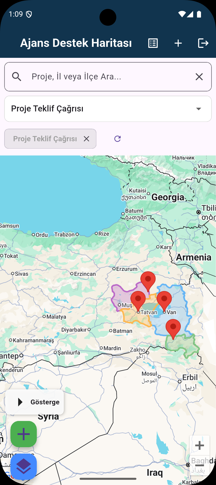
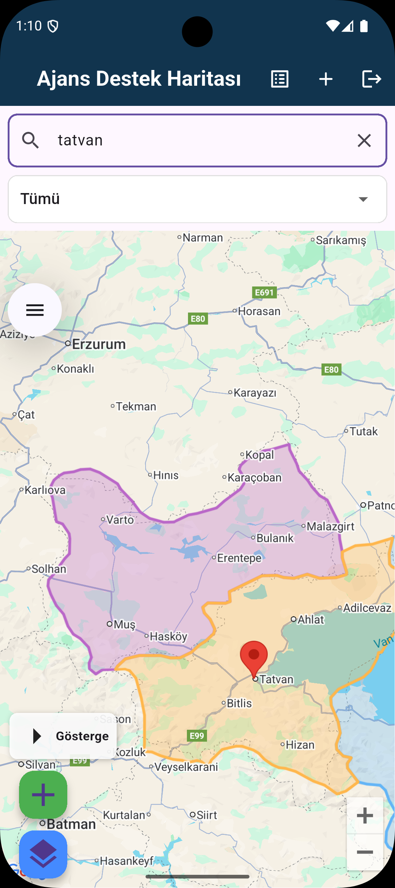
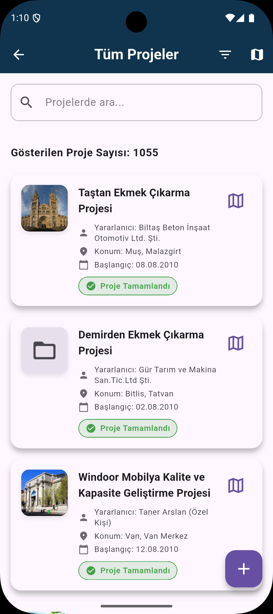
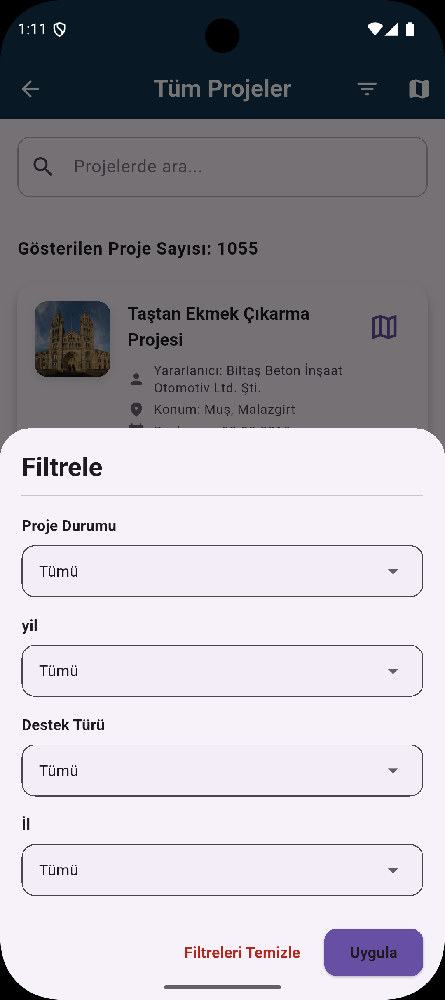
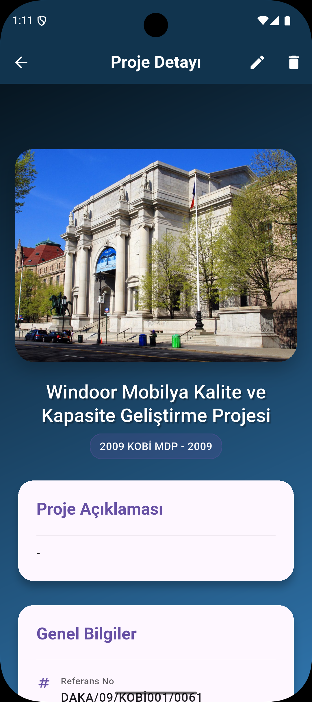

# DAKA İzleme Uygulaması

## 📋 Genel Bakış
DAKA İzleme Uygulaması, Doğu Anadolu Kalkınma Ajansı (DAKA) bünyesinde yürütülen projelerin izlenmesi ve değerlendirilmesi için geliştirilmiş mobil bir uygulamadır. Bu uygulama, DAKA'nın desteklediği projelerin coğrafi konumları, ilerleme durumları ve diğer önemli metriklerini görselleştirerek etkin bir şekilde takip edilmesini sağlar.

## ✨ Özellikler

- 📍 Projelerin harita üzerinde görüntülenmesi
- 🔍 Detaylı proje arama ve filtreleme
- 👥 Rol tabanlı kullanıcı yetkilendirmesi (Yönetici/Kullanıcı)
- 📊 Proje istatistikleri ve raporları
- 📱 Kullanıcı dostu arayüz
- 🌐 Çevrimdışı çalışma desteği
- 📷 Proje fotoğrafları ve doküman yönetimi

## 🛠️ Teknik Özellikler

- **Platform:** Android & iOS
- **Dil:** Dart
- **Framework:** Flutter
- **Veritabanı:** Firebase Firestore
- **Kimlik Doğrulama:** Firebase Authentication
- **Harita Hizmeti:** Google Maps API
- **Durum Yönetimi:** Provider

## 🚀 Kurulum

### Gereksinimler

- Flutter SDK (en son sürüm)
- Dart SDK (en son sürüm)
- Android Studio / Xcode
- Firebase hesabı ve yapılandırılmış proje

### Kurulum Adımları

1. Depoyu klonlayın:
   ```bash
   git clone [repo-url]
   cd dakaizleme
   ```

2. Bağımlılıkları yükleyin:
   ```bash
   flutter pub get
   ```

3. Firebase yapılandırma dosyalarını ekleyin:
   - `android/app/google-services.json`
   - `ios/Runner/GoogleService-Info.plist`

4. Uygulamayı çalıştırın:
   ```bash
   flutter run
   ```

## 👥 Kullanıcı Rolleri

### Yönetici (Admin)
- Tüm projeleri görüntüleme
- Yeni proje ekleme/düzenleme/silme
- Kullanıcı yönetimi
- İstatistikleri görüntüleme

### Standart Kullanıcı
- Projeleri görüntüleme
- Arama ve filtreleme yapma
- Raporlama

## 📱 Ekran Görüntüleri

<div style="display: flex; flex-wrap: wrap; gap: 20px; justify-content: center;">
  <div style="text-align: center;">
    
    <p>Giriş Ekranı</p>
  </div>
  <div style="text-align: center;">
    
    <p>Ana Ekran</p>
  </div>
    <div style="text-align: center;">
    
    <p>Ana Ekran</p>
  </div>
    <div style="text-align: center;">
    
    <p>Ana Ekran</p>
  </div>
    <div style="text-align: center;">
    
    <p>Ana Ekran</p>
  </div>
  <div style="text-align: center;">
    
    <p>Proje Listesi</p>
  <div style="text-align: center;">
    
    <p>Filtreleme Ekranı</p>
  </div>
  <div style="text-align: center;">
    
    <p>Proje Detayı</p>
  </div>

</div>

## 📄 Lisans

Bu proje DAKA (Doğu Anadolu Kalkınma Ajansı) için özel olarak geliştirilmiştir. Tüm hakları saklıdır.

## 📞 İletişim

- **Geliştirici:** Furkan KAYA
- **E-posta:** furkannkayaa49@gmail.com
- **Telefon:** +90 538 385 24 89

## 🌐 DAKA Hakkında

Doğu Anadolu Kalkınma Ajansı (DAKA), bölgesel kalkınma hedefleri doğrultusunda çeşitli projeler yürüten ve destekleyen bir kamu kuruluşudur. Daha fazla bilgi için [resmi web sitesini](https://www.daka.org.tr) ziyaret edebilirsiniz.